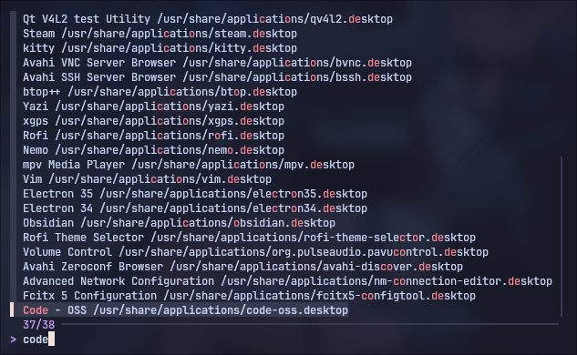

<h3 align="center">
	<br/>
	
	<a href="https://github.com/bt-ASH/hyprun">Hyprun</a>
	
</h3>

<div align="center">

  
  
  

</div>

<p align="center">
		
</p>

**`Hyprun`** is an application launcher derived from **[fzfmenu](https://github.com/levinion/fzfmenu?tab=readme-ov-file#fzfmenu)**. It enables you to launch any software via fuzzy search. This version implements a **delayed startup mechanism** (using `sleep`) to ensure reliable application launching, preventing failures caused by GTK2/GTK3/Qt warning errors.

## **Time to install dependencies!** 

- **hyprland**
- **jq**
- **kitty**
- **bash** (could edit the code by yourself to use other shell like fish or zsh)
- **dex**
- **fd**
- **fzf** (the core dependency)
- **python**
#### **Verify dependencies**
```bash
which hyprland jq kitty dex fd fzf python
```

## Installation & Configuration

1. **Install**  
   Ensure all the required dependencies are installed and that your Hyprland is correctly configured.

2. **Clone**

   ```bash
   git clone https://github.com/bt-ASH/hyprun.git
   ```

3. **Usage**

   ```python
   cd hyprun
   python hyprun.py
   ```

## Configure hyprland 

Add the following configuration to your Hyprland setup. Alternatively, you can place the `hyprun` launcher directly in your `~/.config` directory for easier access:

```
bind = $mainMod, D, exec, /bin/python ~/.config/hyprun.py
```

## Customize

Develop the color scheme for 'hyprun', here using [Catppuccin Dark Macchiato]（ https://github.com/catppuccin/fzf ）For example, in the 'bashrc' configuration, you need to open 'hyprun. py' and find the following content: 
```py
def call_fzf():
     path = os.path.realpath(_file_)
     cmd = [
         terminal,
         ...
     ]
```
Modify configuration and format and save
```py
def call_fzf():
     path = os.path.realpath(_file_)
     cmd = [
         terminal,
         "--color=bg+:#363A4F,spinner:#F4DBD6,hl:#ED8796",
         "--color=fg:#CAD3F5,header:#ED8796,info:#C6A0F6,pointer:#F4DBD6",
         "--color=marker:#B7BDF8,fg+:#CAD3F5,prompt:#C6A0F6,hl+:#ED8796",
         "--color=selected-bg:#494D64,border:#363A4F,label:#CAD3F5",
   
		 ...
	 ]
	 
#  :wq		 
```

&nbsp;

> [!TIP]
> If you are using a transparent terminal background, remove the `bg` option in
> the snippets.

<p align="center">Copyright &copy; 2025-present <a href="https://github.com/bt-ASH" target="_blank">bt-ASH</a>
<p align="center"><a href="https://github.com/catppuccin/catppuccin/blob/main/LICENSE">
</a></p>

<div align="center">


</div>